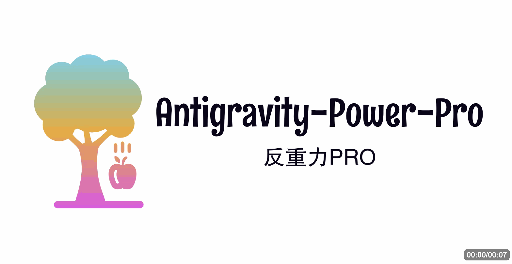

<p align="center">
  
</p>

<h1 align="center">🚀 Antigravity-Power-Pro</h1>

<p align="center">
  <strong>让你的 AI IDE 体验更上一层楼 — 强大的 Antigravity & Windsurf 增强补丁</strong>
</p>

<p align="center">
  <a href="https://github.com/Huo-zai-feng-lang-li/Antigravity-Power-Pro/releases">
    
  </a>
  <a href="https://codeium.com/antigravity">
    
  </a>
  <a href="https://codeium.com/windsurf">
    
  </a>
  <a href="LICENSE">
    
  </a>
  <br>
  <a href="README_EN.md">
    
  </a>
</p>

---

## 🌟 项目简介

**Antigravity-Power-Pro** 是一款专为 **Antigravity AI IDE** 和 **Windsurf IDE** 打造的深度增强工具。它通过巧妙的注入技术，补齐了官方在侧边栏和 Manager 窗口中的体验短板。

无论是复杂的 **Mermaid 渲染**、精确的 **数学公式显示**，还是极大提升效率的 **提示词增强 (Prompt Enhance)**，本项目都致力于为你提供最顺滑、最专业的 AI 辅助编程环境。

---

## ✨ 核心特性

| 功能模块                  | 描述说明                                                    |
| :------------------------ | :---------------------------------------------------------- |
| 📊 **Mermaid 渲染**       | 实时渲染流程图、时序图、类图，完美适配深/浅色模式           |
| 🔢 **数学公式**           | 支持 LaTeX 语法，精准显示 `$行内$` 与 `$$块级$$` 公式       |
| 📋 **一键 Markdown 复制** | 智能提取 AI 回答，自动转换表格、代码块，过滤思考过程        |
| 🎨 **UI 视觉优化**        | 修复深色模式下表格文字不可见问题，精细化布局调整            |
| ⚙️ **Manager 增强**       | 自由调节对话窗口宽度与字体大小，打造最舒适的阅读体验        |
| 🧠 **提示词增强**         | 对接自定义 LLM API，一键优化你的 Prompt (类似 Augment Code) |

### 🌊 Windsurf 专属支持

- ⚡ **内嵌增强按钮**：深度集成至 Windsurf 输入框，实现毫秒级响应。
- ⚓ **智能滚动**：消息区域浮动按钮，助你快速定位到最新对话。

---

## 📸 效果预览

> [!TIP]
> 更多高清效果截图请查看 [效果展示.md](docs/reference/screenshots.md)


---

## 📥 快速开始

### 💻 Windows 用户（推荐）

1. 📥 前往 [Releases](https://github.com/Huo-zai-feng-lang-li/Antigravity-Power-Pro/releases) 下载最新版 `Antigravity-Power-Pro.exe`。
2. 🚀 双击运行（程序具备自动路径识别功能）。
3. ✅ 勾选你想要的功能模块，点击 **「安装补丁」**。
4. 🔄 重启 IDE，立即享受增强体验。

### 🍎 macOS & Linux 用户

1. 下载 [Antigravity-Power-Pro.sh](patcher/patches/Antigravity-Power-Pro.sh) 脚本。
2. 在终端中运行：
   ```bash
   chmod +x ./Antigravity-Power-Pro.sh
   sudo ./Antigravity-Power-Pro.sh
   ```

---

## 🧭 文档索引

- [🎨 效果展示](docs/reference/screenshots.md)
- [🐛 已知问题与修复方案](docs/reference/known-issues.md)
- [🛠️ 开发与贡献指南](docs/guides/developer-guide.md)
- [📦 发布流程说明](docs/guides/release-guide.md)

---

## 📋 版本历史

> [!NOTE]
> 查看官方更新动态：[Antigravity Changelog](https://antigravity.google/changelog)

| 补丁版本   | 支持 IDE 版本      | 发布日期   | 重大更新内容                                     |
| :--------- | :----------------- | :--------- | :----------------------------------------------- |
| **v2.5.5** | v1.15.8 / Windsurf | 2026-03-11 | 提示词增强模块复用优化，修复滚动按钮，去除冗余项 |
| **v2.5.0** | v1.15.8 / Windsurf | 2026-02-10 | **新增 Windsurf IDE 支持**，提示词增强功能上线   |
| **v2.3.9** | v1.15.8            | 2026-01-30 | 修复受控组件下的输入冲突，实现版本号自动侦测     |
| **v2.3.7** | v1.15.8            | 2026-01-29 | 初代提示词增强功能发布，支持自定义 LLM 配置      |
| **v2.2.0** | v1.14.2            | 2026-01-21 | Manager 窗口 Mermaid 渲染与布局调节功能上线      |
| **v2.1.0** | v1.14.2            | 2026-01-19 | 侧边栏字体调节，优化 Markdown 复制逻辑           |

---

## 🤝 参与贡献

我们非常欢迎社区的反馈与支持！

- 提交 [Issue](https://github.com/Huo-zai-feng-lang-li/Antigravity-Power-Pro/issues) 报告 Bug 或提出新功能。
- 提交 [Pull Request](https://github.com/Huo-zai-feng-lang-li/Antigravity-Power-Pro/pulls) 贡献代码。

感谢贡献者: [@mikessslxxx](https://github.com/mikessslxxx)

---

<p align="center">
  💡 如果这个项目提升了你的开发效率, 欢迎点个 <b>Star ⭐</b>
</p>

<p align="center">
  
</p>
